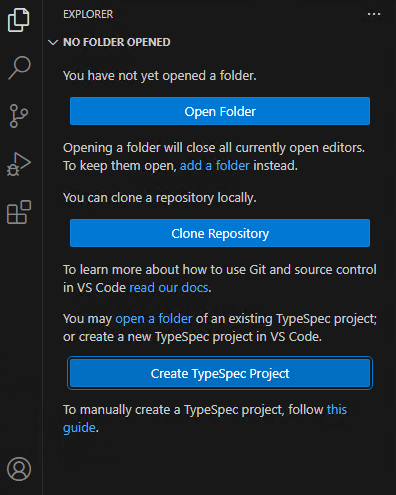
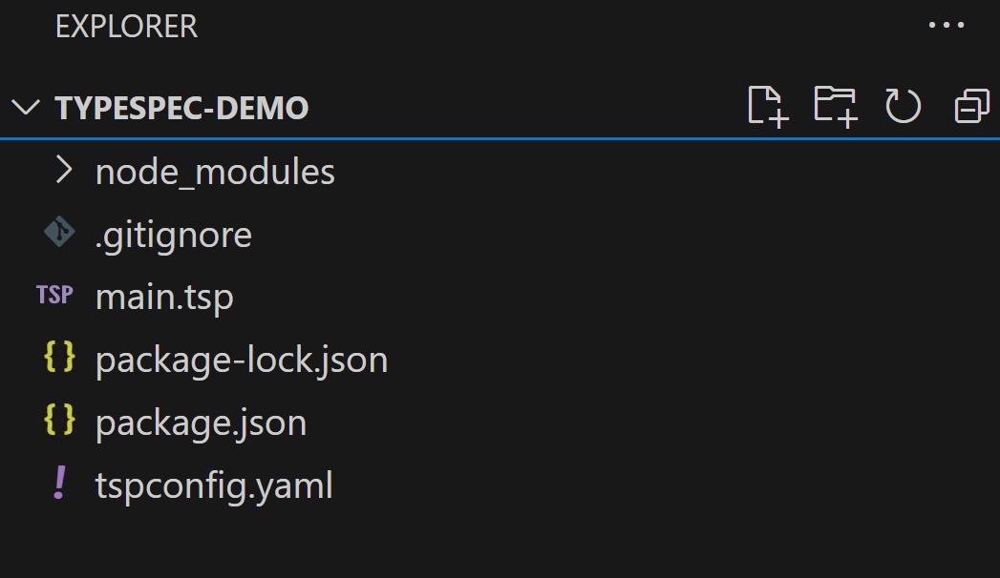
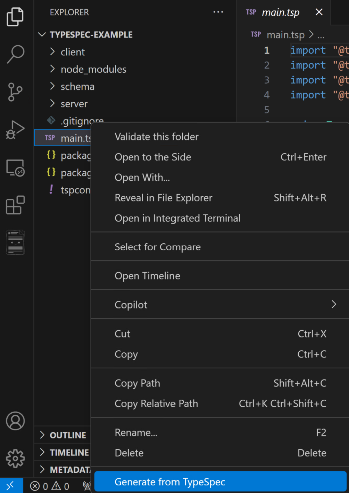
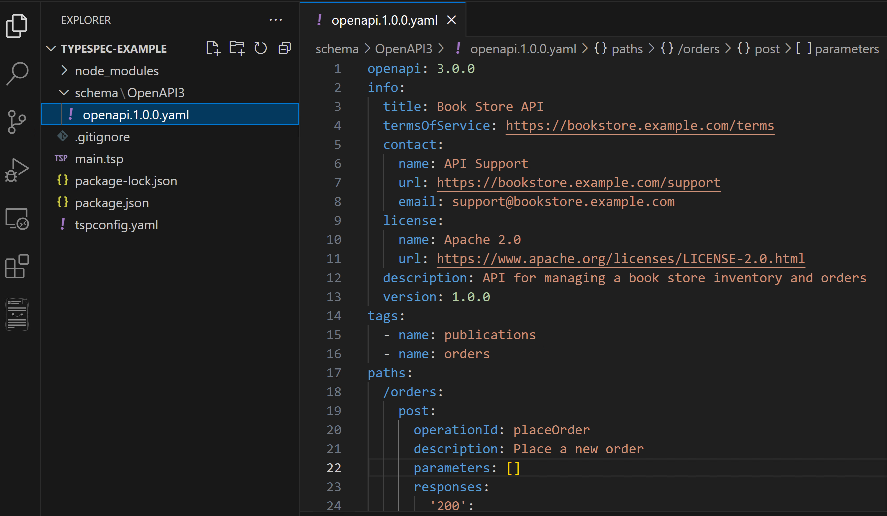
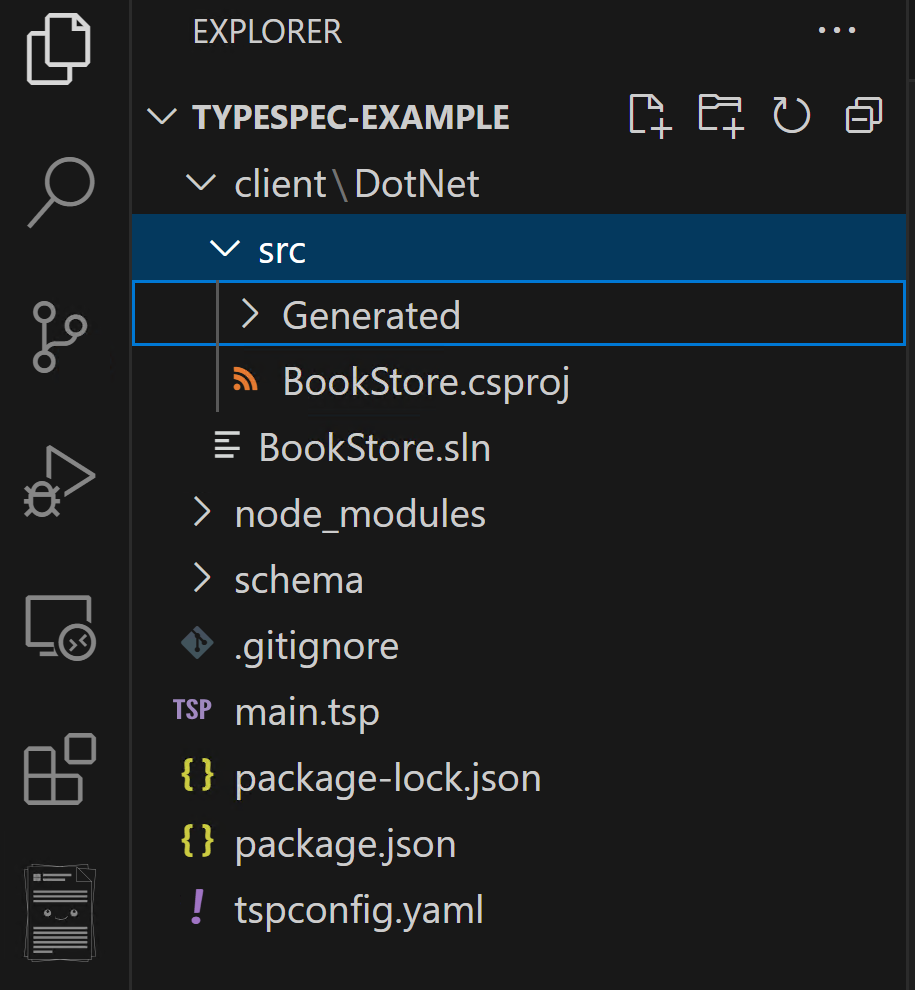
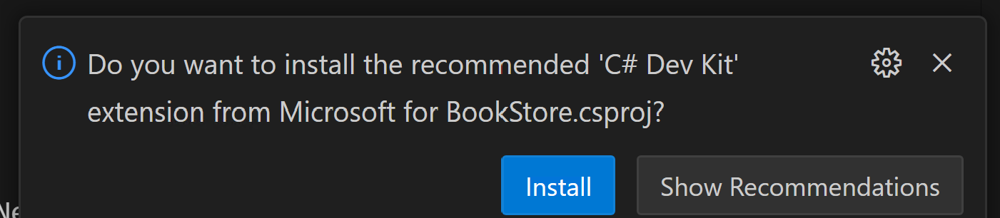

# TypeSpec Out-of-box User Journey

## North Star

### Zero to wow in no time

**We aim to deliver a seamless experience where TypeSpec users can effortlessly set up new projects using a simple CLI command or VSCode. With a rich diagnostic system, a developer-friendly environment, and intuitive options for common tasks, users can focus on building exceptional APIs without worrying about underlying complexities.**

This document outlines the streamlined user experience for creating and working with a TypeSpec project, from the initial setup to generating client and server projects. It provides guidance on two primary workflows:

- [Using the Command-Line Interface (CLI)](#cli)
- [Using the Visual Studio Code (VSCode) IDE with the TypeSpec Extension](#typespec-extension-for-vs-code)

These workflows are designed to offer a seamless and productive experience for new and experienced users alike, ensuring they can get started quickly while exploring the full capabilities of TypeSpec.

## Environment Setup

Before you begin, ensure you have met the following requirements:

- You have installed [Node.js](https://nodejs.org/) (version 14.x or later).
- You have installed [npm](https://www.npmjs.com/) (version 6.x or later).

Next, you need to install TypeSpec CLI and compiler.

```bash
npm install -g @typespec/compiler@next
```

That's it. Now check out steps below to create your first TypeSpec project.

## CLI

### Overview

Leveraging built-in template, `tsp init` provides a convenient way to scaffold TypeSpec projects.

- You can use `sandbox` folder to test out the CLI experience.
- During `npx tsp init`, you will be prompted to select include different protocol/client/server emitters.
- Please review the post creation message and install any development kit required for that language.

```bash
cd [your TypeSpec project folder]

# In emitter selection step, you can multi-select various client/server emitters. PLEASE leave `openapi3` emitter selected.
npx tsp init

tsp install

# This should generate openapi and any selected client and/or server code.
tsp compile .
```

Once the above steps are completed, you should see the following folder structure depending on the emitters you have selected.

```text
    \XXXX
        \openapi                    # Generated OpenAPI 3.0 spec
            openapi.yaml
        \clients                    # Generated Client SDK for selected language
            \dotnet
            \java
            ...
        \servers                    # Generated Server Code
            \aspnet
            \node
        main.tsp
        tspconfig.yaml
        package.json
```

### Compile Client SDKs

If you have selected client emitters, you can use the following commands to compile the client project in the client sdk folder.

| **Language** | **Command**                |
| ------------ | -------------------------- |
| C#           | `dotnet build`             |
| Java         | `mvn package`              |
| Python       | N/A                        |
| JS/TS        | `npm install && npm build` |

### Compile and Test Server

- asp.net:
  - Run `dotnet run`
  - use browser to `http://localhost:XXXX/swagger/index.html` where XXXX is the port number shown
  - You can use Swagger UI's `Try it out` to interact with the running service

- node/express: TBA

## TypeSpec Extension for VS Code

### Overview of the extension

The extension is focusing on improving the API/SDK producer's experience in prototyping API using TypeSpec.  It supports IntelliSense for authoring TypeSpec and provides interactive guidance within VS Code IDE for:

- Scaffolding TypeSpec projects using various templates
- Generating OpenAPI 3.0 from TypeSpec
- Generating client code from TypeSpec
- Generating server stub from TypeSpec

You can quickly start and explore TypeSpec's full capabilities within TypeSpec extension for VS Code.

### Installation

- Install prerequisites
  - Install node.js 20 LTS or above in an **administrative** shell, verify that `node --version` and `npm --version` run in a command prompt.
  - Install TypeSpec Compiler in **global** mode.

    ```bash
    npm install -g @typespec/compiler
    ```

- Install the extension

Note:

- If TypeSpec Compiler is not installed or the version installed has reached its end of service, users will be prompted to install the latest version when the extension is loaded upon creating a TypeSpec project.
- If `node --version` and `npm --version` don't run correctly in command prompt, indicating a problem with Node.js installation, it causes errors when installing TypeSpec Compiler.

### Project Scaffolding

To create a TypeSpec Project in VS Code, you click “Create TypeSpec Project” in the EXPLORE sidebar.



After selecting a project root folder, you provide the required inputs via Quick Picks, the same as using the CLI - “tsp init”. This process will establish a TypeSpec project with a structure like this:



Once your project is set up, you can prototype APIs using TypeSpec with IntelliSense features like code completion, parameter info, quick info, and member lists.

### Generate the OpenAPI Document

After finishing your TypeSpec specification, you can generate an OpenAPI document from it. To do this, right-click on a .tsp file to open the Context Menu, then select “Generate from TypeSpec” to start the generation process.



When you select “OpenAPI” from the emitter types and choose “OpenAPI 3 – Generate OpenAPI 3 document by @typespec/openapi3” in the subsequent Quick Pick, the TypeSpec compiler will run in the background to generate a new directory named “schema\OpenAPI3”. Utilizing the versioning library, the OpenAPI document will be created for the specified API version. The file produced by the OpenAPI 3 emitter will be named `openapi.<version>.yaml`.



### Generate the Client Code and the Server Stub

You can also generate client codes and server stubs of a specified language from you TypeSpec specification.  Again, to do this, right-click on a .tsp file to open the Context Menu, select “Generate from TypeSpec” to start the generation process. For example, When you select “Client Code” from the Emitter Types and choose “.NET – Generate .Net client code by @typespec/http-client-csharp” in the subsequent Quick Pick, the TypeSpec compiler will run in the background.

TypeSpec Compiler will run in the background to generate a new directory name "client\<language>".



#### Compile Code Generated

After generating code, opening a source file will prompt you to install the recommended language extension. You can then edit and compile the code with the extension's help.


